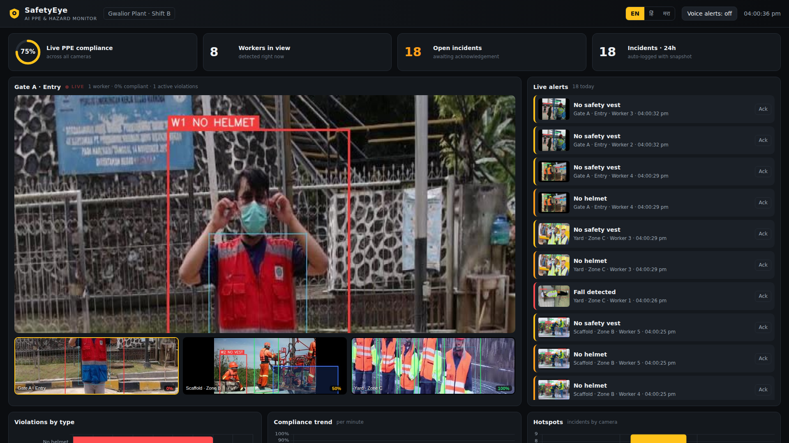

# SafetyEye — AI PPE & Hazard Monitor for Indian worksites

> **INDUX 5.0 · Theme: Environment, Health & Safety (EHS)** — also covers Computer Vision, Smart Manufacturing and Multilingual AI.

SafetyEye turns the CCTV cameras a factory or construction site **already has** into a real-time safety officer. It detects missing PPE, restricted-zone entry and falls, raises **multilingual alerts (English / हिंदी / मराठी)**, logs every incident with a snapshot, and writes a plain-language shift report. Everything runs **on-premise on a CPU**, so no video leaves the site.



## Why
Construction and manufacturing account for a large share of India's fatal workplace accidents, and missing head protection and falls are among the most common causes. A safety officer cannot watch every camera for a whole shift. SafetyEye watches all of them, continuously.

## What it does
| Capability | How |
|---|---|
| **PPE compliance** (helmet, hi-vis vest; gloves / boots / goggles also detected) | YOLO11n fine-tuned on the Construction-PPE dataset (11 classes) |
| **Per-worker reasoning** | PPE items are assigned to each person by box containment → "W2 NO HELMET" |
| **Fall detection** | YOLO11n-pose keypoints: shoulder→hip torso angle, plus aspect-ratio fallback |
| **Restricted zones** | Polygons per camera; a worker's feet inside the zone triggers an alert |
| **Live alerts** | WebSocket feed, severity colours, critical banner, browser voice alerts in EN / HI / MR |
| **Incident log** | SQLite + JPEG snapshot per incident, 30 s de-duplication, acknowledge workflow, CSV export |
| **Analytics** | Live compliance ring, violations by type, compliance trend, hotspot cameras |
| **Shift report** | Auto-generated summary with recommended actions |
| **Ad-hoc checks** | Upload any photo or use a webcam from the dashboard |

## Architecture
```
 CCTV / RTSP / video / image folder ─┐
                                      ▼
                       camera worker threads (server/app.py)
                                      │ frame
                     ┌────────────────┴────────────────┐
              PPE YOLO11n (models/ppe.pt)      YOLO11n-pose (falls)
                     └────────────────┬────────────────┘
               rule engine (server/detector.py): worker ↔ PPE, zones, falls
                                      │
          SQLite incidents + snapshots ── REST /api/* ── WebSocket /ws
                                      │
                    Dashboard (web/) · voice alerts · shift report
```

## Model
YOLO11n fine-tuned for 15 epochs at 416 px **on a 2-core CPU** using the Ultralytics **Construction-PPE** dataset (1,132 train / 143 val / 141 test images). Results: [`docs/metrics.md`](docs/metrics.md). Script: [`training/train_ppe.py`](training/train_ppe.py).

## Run it
```bash
pip install -r requirements.txt
cd server && uvicorn app:app --port 8000
# open http://localhost:8000
```
Cameras are configured in `server/app.py` (`CAMERAS`); a source can be an image folder, a video file or an RTSP URL. `samples/` holds frames from the dataset's held-out test/val split so the demo runs offline.

Env vars: `SAFETYEYE_PPE` (weights path), `SAFETYEYE_COOLDOWN` (seconds between repeat alerts, default 30), `SAFETYEYE_FRAME_SECONDS` (analysis interval per camera).

## Roadmap (24-hour on-site round)
- RTSP multi-camera ingestion + ByteTrack IDs (one worker = one incident)
- WhatsApp / SMS escalation to the site supervisor for critical events
- Edge deployment on Jetson / Raspberry Pi 5 via ONNX / OpenVINO
- More Indian languages (Tamil, Telugu, Bengali) for PA announcements
- Heat-stress and fire / smoke detection

## Credits & licence
Built by Swapnil Chaudhari. Uses [Ultralytics YOLO](https://github.com/ultralytics/ultralytics) and the Ultralytics Construction-PPE dataset (AGPL-3.0); this project is therefore released under **AGPL-3.0**.
