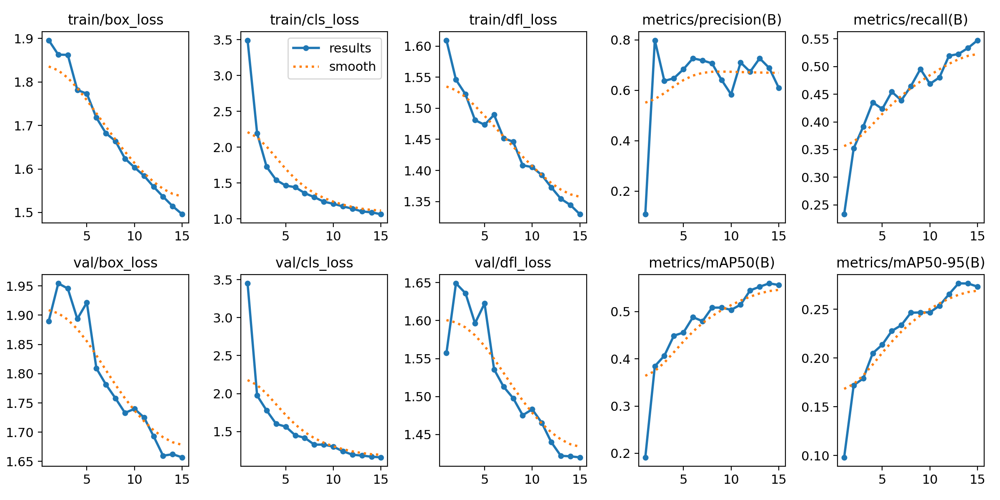

# PPE model metrics

YOLO11n, 416 px, 15 epochs on CPU. Evaluated on the **held-out test split** (141 images) of the Ultralytics Construction-PPE dataset.

| Class | P | R | mAP50 | mAP50-95 |
|---|---|---|---|---|
| helmet | 0.93 | 0.85 | 0.91 | 0.49 |
| gloves | 0.89 | 0.65 | 0.73 | 0.36 |
| vest | 0.87 | 0.85 | 0.91 | 0.58 |
| boots | 0.73 | 0.65 | 0.71 | 0.38 |
| goggles | 0.70 | 0.71 | 0.74 | 0.30 |
| none | 0.79 | 0.51 | 0.50 | 0.16 |
| Person | 0.85 | 0.83 | 0.84 | 0.52 |
| no_helmet | 0.76 | 0.12 | 0.27 | 0.09 |
| no_goggle | 1.00 | 0.00 | 0.14 | 0.04 |
| no_gloves | 0.22 | 0.02 | 0.08 | 0.02 |
| no_boots | 1.00 | 0.00 | 0.00 | 0.00 |
| **all** | 0.79 | 0.47 | **0.53** | 0.27 |

SafetyEye enforces helmet + vest (the two strongest classes). Negative classes (`no_*`) are rare in the data and weak, so missing PPE is inferred by the rule engine from the *absence* of a helmet/vest on a detected person rather than from `no_*` detections alone.

